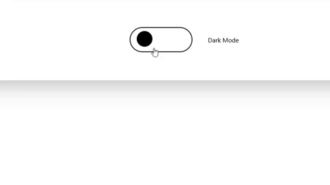

## First Dark Mode w/JS and Tailwind

- This is my first JS project, very enjoyable to play CSS's with JS.
- I use toggle for transition effects, but dont know why it cant taking more classes than 1.
- Therefore, I had to write 3-4 lines of code for an element.
- This little guy not keeping data on local storage, it's just a playground for me. 

## Gif about visual
